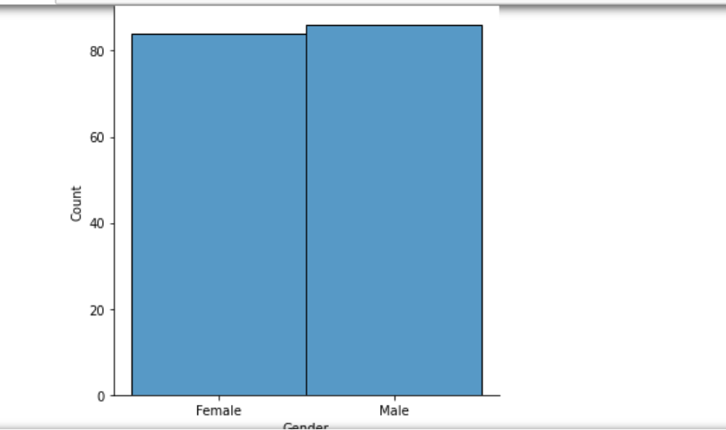

# Ex-04-EDA:

## AIM:
To perform EDA on the given data set. 

# Explanation:
The primary aim with exploratory analysis is to examine the data for distribution, outliers and 
anomalies to direct specific testing of your hypothesis.
 

# ALGORITHM:
### STEP 1:
Import the pandas, seaborn, numpy packages.

### STEP 2:
Download and open the Dataset.

### STEP 3:
Remove the null values from the given data and then remove the outliers.

### STEP 4:
Remove the non-numerical data columns using drop() method.

### STEP 5:
Return object containing counts of unique values using value_counts().

### STEP 6:
Plot the counts in the form of Histogram or Bar Graph.

### STEP 7:
Find the pairwise correlation of all columns in the dataframe using .corr().

### STEP 8:
Save the final data set into the file.

# CODE:
~~~

#Developed by:S Adithya Chowdary.
#Register no:212221230100.

import pandas as pd
import numpy as np
import seaborn as sns
df=pd.read_csv("supermarket.csv")
df

df.isnull().sum()

df.boxplot()

cols = ['Unit price','Quantity','Tax 5%','Total','cogs','gross margin percentage','gross income','Rating']
Q1 = df[cols].quantile(0.25)
Q3 = df[cols].quantile(0.75)
IQR = Q3 - Q1
df = df[~((df[cols] < (Q1 - 1.5 * IQR)) |(df[cols] > (Q3 + 1.5 * IQR))).any(axis=1)]
df
df.boxplot()

df['Branch'].value_counts()
df['City'].value_counts()
df['Customer type'].value_counts()
df['Gender'].value_counts()
df['Product line'].value_counts()
df['Quantity'].value_counts()
df['Payment'].value_counts()

pd.crosstab(df["Customer type"],df["Branch"])
pd.crosstab(df["Customer type"],df["City"])
pd.crosstab(df["Customer type"],df["Gender"])
pd.crosstab(df["Customer type"],df["Payment"])
pd.crosstab(df["Product line"],df["Quantity"])

df.corr()

sns.countplot(x="Branch",data=df)
sns.countplot(x="City",data=df)
sns.countplot(x="Customer type",data=df)
sns.countplot(x="Payment",data=df)
sns.countplot(x="Gender",data=df)
sns.countplot(y="Product line",data=df)
sns.countplot(x="Quantity",data=df)

sns.displot(df["Unit price"])
sns.displot(df["Tax 5%"])
sns.displot(df["cogs"])
sns.displot(df["gross income"])

sns.countplot(x="City",hue="Customer type",data=df)
sns.countplot(x="Branch",hue="Customer type",data=df)
sns.countplot(x="Gender",hue="Customer type",data=df)
sns.countplot(x="Payment",hue="Customer type",data=df)
sns.countplot(y="Product line",hue="Quantity",data=df)

sns.displot(df[df["City"]=='Yangon']["cogs"])
sns.displot(df[df["City"]=='Mandalay']["cogs"])
sns.displot(df[df["City"]=='Naypyitaw']["cogs"])

sns.displot(df[df["Product line"]=='Health and beauty']["Gender"])
sns.displot(df[df["Product line"]=='Electronic accessories']["Gender"])
sns.displot(df[df["Product line"]=='Home and lifestyle']["Gender"])
sns.displot(df[df["Product line"]=='Sports and travel']["Gender"])
sns.displot(df[df["Product line"]=='Food and beverages']["Gender"])
sns.displot(df[df["Product line"]=='Fashion accessories']["Gender"])

sns.displot(df[df["Gender"]=='Male']["gross income"])
sns.displot(df[df["Gender"]=='Female']["gross income"])

df.drop('gross margin percentage',axis=1,inplace=True)
sns.heatmap(df.corr(),annot=True)
~~~
# OUPUT

# RESULT:
The given data has been cleaned and outlier has been removed and the EDA on the given data has been performed sucessfully.
